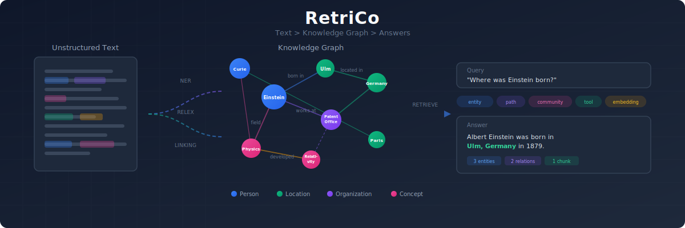
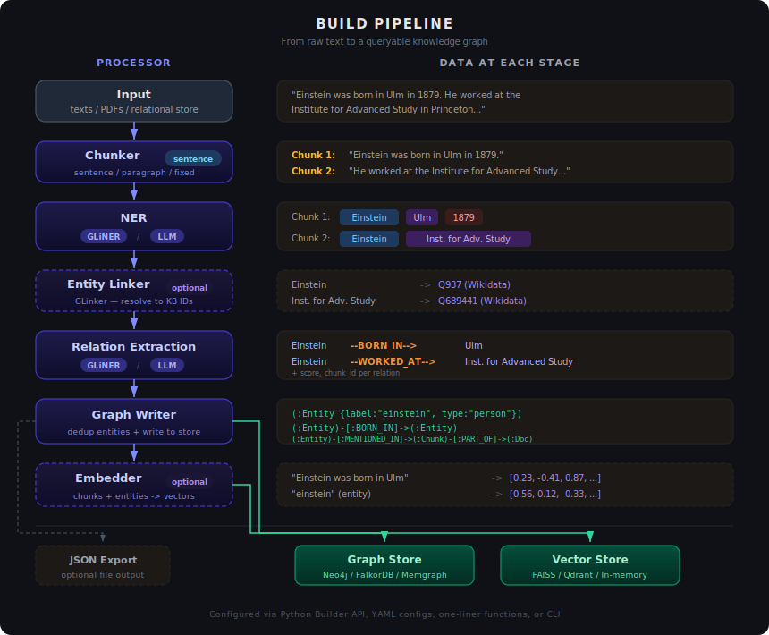

# RetriCo — End-to-End Graph RAG Framework

<div align="center">
    <div>
        <a href="https://discord.gg/dkyeAgs9DG"></a>
        <a href="https://www.apache.org/licenses/LICENSE-2.0"></a>
        <a href="https://pypi.org/project/retrico/"></a>
    </div>
    <br>
</div>



> A modular, declarative framework that turns unstructured text into a queryable knowledge graph.
> Built on [Knowledgator](https://github.com/Knowledgator) technologies ([GLiNER](https://github.com/urchade/GLiNER), [GLinker](https://github.com/Knowledgator/GLinker)).

## Installation

```bash
pip install retrico
```

Optional extras:

```bash
pip install openai          # LLM-based extraction (any OpenAI-compatible API)
pip install glinker         # Entity linking
pip install falkordb        # FalkorDB graph store
pip install pykeen          # KG embedding training
pip install 'retrico[pdf]'  # PDF text + table extraction
```

Requires Python 3.10+.

## Quickstart

### Build a Knowledge Graph

```python
import retrico

result = retrico.build_graph(
    texts=[
        "Albert Einstein was born in Ulm, Germany in 1879.",
        "Marie Curie conducted pioneering research on radioactivity at the University of Paris.",
    ],
    entity_labels=["person", "organization", "location"],
    relation_labels=["born in", "works at"],
)

stats = result.get("writer_result")
print(f"Entities: {stats['entity_count']}, Relations: {stats['relation_count']}")
```

By default, RetriCo uses FalkorDB Lite (embedded, zero-config). Switch to Neo4j, FalkorDB server, or Memgraph with `store_config=`:

```python
result = retrico.build_graph(
    texts=[...],
    entity_labels=["person", "location"],
    store_config=retrico.Neo4jConfig(uri="bolt://localhost:7687", password="password"),
)
```

### Query the Knowledge Graph

```python
result = retrico.query_graph(
    query="Where was Einstein born?",
    entity_labels=["person", "location"],
    api_key="sk-...",       # any OpenAI-compatible key; omit to skip LLM reasoning
    model="gpt-4o-mini",
)

print(result.answer)             # "Albert Einstein was born in Ulm, Germany."
print(result.subgraph.entities)  # retrieved entities
print(result.subgraph.relations) # retrieved relations
```

### Extract Without Storing

```python
result = retrico.extract(
    texts=["Einstein developed relativity at the Swiss Patent Office."],
    entity_labels=["person", "concept", "organization"],
    relation_labels=["developed", "works at"],
)

for text_entities in result.entities:
    for e in text_entities:
        print(f"  [{e.label}] {e.text}")
```

## Why RetriCo?

Most Graph RAG frameworks use a monolithic class where every component — LLM client, embedder, graph driver — is wired together in a single constructor. Customizing anything means importing provider-specific classes and rewriting setup code.


RetriCo takes a different approach: **declarative, modular pipelines** where each component is an independent processor in a DAG. Swap any part — NER backend, graph database, retrieval strategy — without changing the rest.

```python
builder = retrico.RetriCoBuilder(name="my_pipeline")
builder.chunker(method="sentence")
builder.ner_gliner(labels=["person", "org", "location"])        # or builder.ner_llm(...)
builder.relex_gliner(entity_labels=[...], relation_labels=[...]) # or builder.relex_llm(...)
builder.graph_writer()
executor = builder.build()
result = executor.run(texts=["Einstein worked at the Swiss Patent Office in Bern."])
```

Save as YAML for reproducibility, load and run anywhere:

```python
builder.save("pipeline.yaml")
executor = retrico.ProcessorFactory.create_pipeline("pipeline.yaml")
```

### Key Advantages


- **Local and fast extraction** — [GLiNER](https://github.com/urchade/GLiNER) runs efficiently on CPU/GPU with zero API costs. Switch to any OpenAI-compatible LLM when you need higher accuracy, or mix both (GLiNER NER + LLM relation extraction).
- **Modular pipelines** — Every component is a registered processor. NER backends (`ner_gliner`, `ner_llm`) produce identical output shapes, so they are fully interchangeable. Same for relation extraction, graph stores, and retrieval strategies.
- **Multiple graph backends** — Neo4j, FalkorDB, FalkorDB Lite (embedded), and Memgraph. Configure once at the pipeline level; all components share connections through a store pool.
- **9 retrieval strategies** — Entity lookup, shortest paths, community search, chunk embeddings, entity embeddings, tool-calling agent, keyword search, KG-scored retrieval, and multi-retriever fusion.
- **Declarative configuration** — Define pipelines programmatically (Builder API), as YAML configs, or via one-liner convenience functions. All three are equivalent.
- **Full CLI** — `retrico build`, `retrico query`, `retrico shell` (REPL), `retrico graph` (CRUD), interactive wizards — no Python code needed.

## Use Cases

- **Factual generation** — Ground LLM responses in explicit graph evidence to reduce hallucination
- **Personalization** — Capture user-specific knowledge into a personal graph for agentic memory
- **Recommendation** — Use link prediction (KG embeddings) and community structure for suggestions
- **Knowledge discovery** — Infer new relationships from existing knowledge, especially in biology and medicine
- **Better search** — Combine structured graph queries with semantic vector search

## Builder API

### Build Pipeline

```python
from retrico import RetriCoBuilder

builder = RetriCoBuilder(name="science_graph")
builder.graph_store(retrico.Neo4jConfig(uri="bolt://localhost:7687"))
builder.chunker(method="sentence")
builder.ner_gliner(labels=["person", "organization", "location"])
builder.relex_gliner(entity_labels=[...], relation_labels=["works at", "born in"])
builder.linker(model="knowledgator/gliner-linker-large-v1.0", entities="kb.jsonl")  # optional
builder.graph_writer(json_output="output/data.json")  # optional JSON export
builder.chunk_embedder()  # optional embeddings
executor = builder.build(verbose=True)
result = executor.run(texts=["Isaac Newton formulated the laws of motion."])
```

### Query Pipeline

```python
from retrico import RetriCoSearch

builder = RetriCoSearch(name="my_query")
builder.query_parser(method="gliner", labels=["person", "location"])
builder.retriever(max_hops=2)          # or path_retriever(), community_retriever(), tool_retriever(), ...
builder.chunk_retriever()
builder.reasoner(api_key="sk-...", model="gpt-4o-mini")
executor = builder.build()
result = executor.run(query="Where was Einstein born?")
```

### Ingest Structured Data

```python
import retrico

retrico.ingest_data(
    data=[
        {
            "entities": [
                {"text": "Einstein", "label": "person", "properties": {"birth_year": 1879}},
                {"text": "Ulm", "label": "location"},
            ],
            "relations": [
                {"head": "Einstein", "tail": "Ulm", "type": "born_in"},
            ],
            "text": "Einstein was born in Ulm.",
        },
    ],
    store_config=retrico.Neo4jConfig(uri="bolt://localhost:7687"),
)
```

## CLI

```bash
retrico connect                          # save database connection
retrico build --file paper.txt --entity-labels "person,org,location"
retrico query "Where was Einstein born?" --entity-labels "person,location" --api-key sk-...
retrico ingest data.json                 # ingest structured JSON
retrico community --method leiden        # community detection
retrico model --kg-model RotatE          # train KG embeddings
retrico graph stats                      # graph CRUD operations
retrico shell --entity-labels "person"   # interactive REPL
retrico init build                       # generate pipeline YAML interactively
```

## Supported Databases

| Category | Backends |
|----------|----------|
| **Graph** | FalkorDB Lite (default, embedded), Neo4j, FalkorDB (server), Memgraph |
| **Vector** | In-memory, FAISS, Qdrant, Graph DB-backed |
| **Relational** | SQLite, PostgreSQL, Elasticsearch |

## Documentation

Full documentation: **[docs.knowledgator.com/docs/frameworks/retrico](https://docs.knowledgator.com/docs/frameworks/retrico)**

- [Quickstart](https://docs.knowledgator.com/docs/frameworks/retrico/quickstart) — build your first knowledge graph
- [Building](https://docs.knowledgator.com/docs/frameworks/retrico/building) — pipeline components, LLM & mixed modes, PDF, structured ingest
- [Retrieving](https://docs.knowledgator.com/docs/frameworks/retrico/retrieving) — 9 retrieval strategies + fusion
- [Databases](https://docs.knowledgator.com/docs/frameworks/retrico/databases) — graph, vector, relational store setup
- [Modeling](https://docs.knowledgator.com/docs/frameworks/retrico/modeling) — community detection & KG embeddings
- [CLI](https://docs.knowledgator.com/docs/frameworks/retrico/cli) — command-line interface reference
- [LLM Tool Use](https://docs.knowledgator.com/docs/frameworks/retrico/tools) — function calling & custom tools

## License

Apache 2.0
